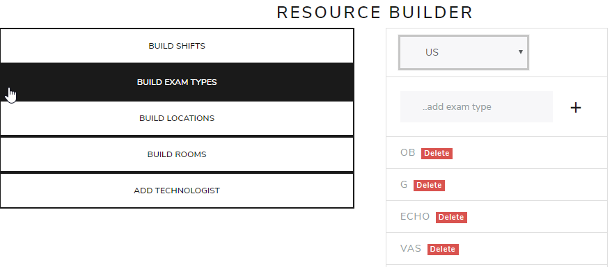
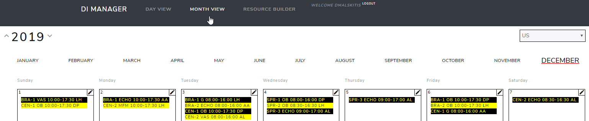
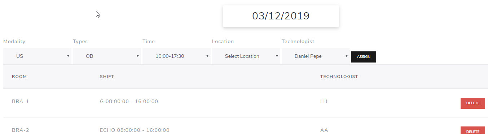
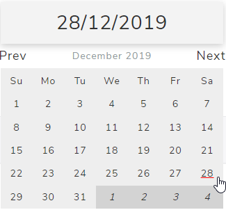
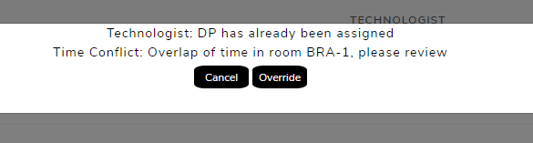

# DI Manager

DI Manager is an application for diagnostic imaging coordinators/managers to build, customize and schedule shifts in multi-site multi-room facility with different modalities, exam times and technologists with month and day based views. Non-Managers have access to day and month view w/ read-only permission.

## Features
* **Resource Builder**: build and customize shifts, exam types, locations, rooms

  

* **Month View**: view & edit shifts for a month

  

* **Day View**: view & assign shifts on a day

  

  

* built in validation for conflicting shifts and technologist

  

